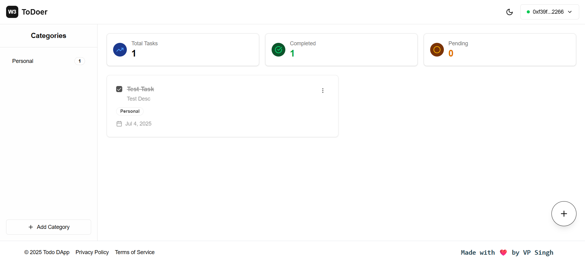
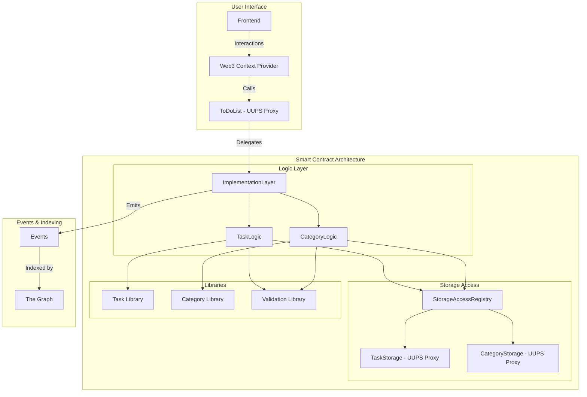
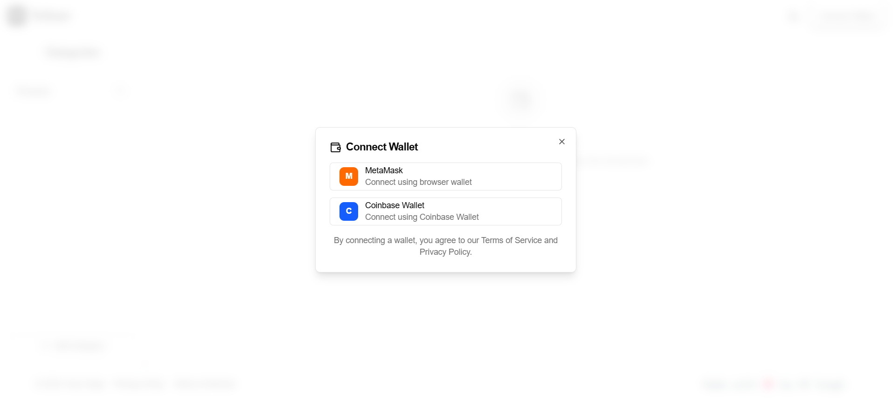
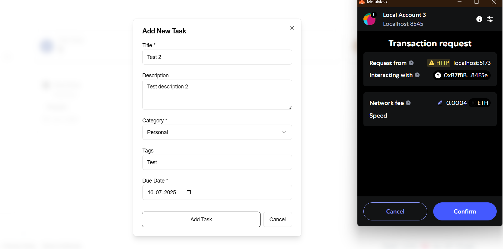
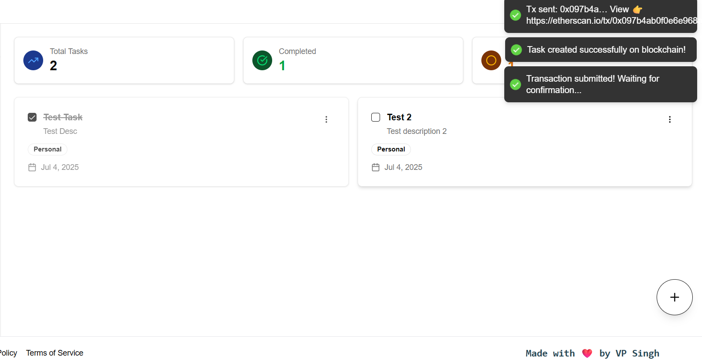
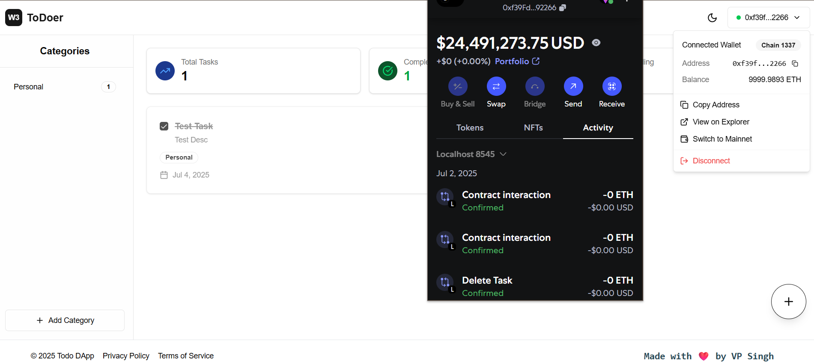

# 📝 ToDoer – Web3-Powered Task Management DApp
#### **👤 Author:** Vinay Pratap Singh

---


ToDoer is a fully decentralized, smart contract-backed task management DApp built with modern Web3 tooling. It empowers users to create, manage, and track their tasks securely and transparently on the blockchain, with features like categories, tags, due dates, and wallet-based identity.



---

## 🚀 Features

* ✅ Create, update, delete tasks with tags, priorities, due dates
* ✅ Smart contract-based task storage (fully on-chain)
* ✅ Create and manage task categories
* ✅ Wallet authentication (MetaMask & Coinbase)
* ✅ Real-time transaction status
* ✅ Full task history & state transitions
* ✅ Light/dark themes, responsive UI
* ✅ Fully integrated with Ethereum-compatible networks

---

## 🧱 Tech Stack

| Layer           | Technology                                         |
| --------------- | -------------------------------------------------- |
| Frontend        | React, TypeScript, TailwindCSS, Ethers.js          |
| State Mgmt      | Context API, useReducer                            |
| Web3            | Ethers.js, MetaMask, Coinbase Wallet               |
| Smart Contracts | Solidity (Hardhat), OpenZeppelin                   |
| Deployment      | Vercel (Frontend), Hardhat / Etherscan (Contracts) |
| Testing         | React Testing Library, Jest, Hardhat (Mocha/Chai)  |

---

## 🏛️ Project Architecture

### 🔷 Architectural Flow Diagram



---

## 📁 Folder Structure

```
├── contracts/
│   ├── core/
│   │   ├── TodoList.sol                  # Main UUPS proxy-based entrypoint
│   │   └── StorageAccessRegistry.sol     # Registry for dynamic contract resolution
│   ├── logic/
│   │   ├── TaskLogic.sol                 # Logic to manage tasks (uses registry)
│   │   └── CategoryLogic.sol             # Logic to manage categories (uses registry)
│   ├── storage/
│   │   ├── TaskStorage.sol               # UUPS upgradeable persistent task storage
│   │   └── CategoryStorage.sol           # UUPS upgradeable persistent category storage
│   ├── interfaces/
│   │   ├── ITodoList.sol
│   │   ├── ITypes.sol
│   │   ├── ITaskStorage.sol
│   │   ├── ICategoryStorage.sol
│   │   ├── ITaskLogic.sol
│   │   ├── ICategoryLogic.sol
│   │   └── IStorageAccessRegistry.sol
│   ├── proxy/
│   │   ├── TodoListProxy.sol             # Transparent proxy (optional alternative)
│   │   └── TodoListProxyAdmin.sol        # Proxy admin contract
│   └── libraries/
│       ├── TaskLib.sol
│       ├── CategoryLib.sol
│       └── ValidationLib.sol
├── client/
│   ├── pages/
│   │   └── Home.tsx
│   ├── assets/
│   ├── components/
│   ├── context/
│   ├── lib/
│   ├── hooks/
│   ├── utils/
│   ├── types/
│   ├── config/
│   └── styles/
├── scripts/                   # Deployment scripts
├── test/                      # Contract & frontend tests
├── hardhat.config.ts         # Hardhat configuration
└── README.md                 # Project documentation
```

---

## 📷 Screenshots

| Wallet Connection                | Task Creation Modal            |
| -------------------------------- | ------------------------------ |
|  |  |

| Task Board                  | Network Management          |
| --------------------------- | --------------------------- |
|  |  |

---

## 🛠️ Installation & Local Setup

### Prerequisites

* Node.js ≥ 18.x
* Yarn / PNPM
* Hardhat
* MetaMask / Coinbase Wallet

### 1️⃣ Clone the Repo

```bash
git clone https://github.com/your-username/ToDo-DApp.git
cd ToDo-DApp
npm install
cd client
npm install
```

### 2️⃣ Setup Environment

Create a `.env` file at root:

```env
SEPOLIA_URL=your_alchemy_or_infura_url
PRIVATE_KEY=your_wallet_private_key
ETHERSCAN_API_KEY=your_etherscan_api_key
```
NOTE: You don't need to store contract address, it will automatically stored at @/deployed.contracts.json

### 3️⃣ Start Local Blockchain

```bash
pnpm hardhat node
```

### 4️⃣ Deploy Smart Contracts

```bash
pnpm hardhat run scripts/deploy.ts --network localhost
```
Note: This will deploy your smart contract using this. It will automatically store, all important contract addresses at @/deployed.contracts.json and also export ABI config at @/client/src/lib/TodoListABI.json, which can be accessible through contract.ts file in the same folder.

### 5️⃣ Start the Frontend

```bash
cd client
npm run dev
```

App will be running at: [http://localhost:3000](http://localhost:3000)

---

## 🔐 Smart Contracts – Core & Modules

### Core

* **TodoList.sol** *(UUPS Proxy)* – Entrypoint via StorageAccessRegistry
* **StorageAccessRegistry.sol** – Maps logic & storage implementations

### Logic

* **TaskLogic.sol** – Functions to create/update/delete tasks
* **CategoryLogic.sol** – Functions to create & fetch categories

### Storage

* **TaskStorage.sol** *(UUPS Proxy)* – On-chain persistent storage for tasks
* **CategoryStorage.sol** *(UUPS Proxy)* – On-chain persistent storage for categories

### Interfaces & Libraries

* `ITodoList`, `ITypes`, `ITaskStorage`, `ICategoryStorage`, `ITaskLogic`, `ICategoryLogic`, `IStorageAccessRegistry`
* `TaskLib`, `CategoryLib`, `ValidationLib`

##### Function List (via ITodoList.sol)

```solidity
function createTask(string _content, string _description, Priority _priority, uint _dueDate, uint _categoryId, string[] _tags) external returns (uint);
function updateTask(uint _taskId, string _content, string _description, Priority _priority, uint _dueDate, string[] _tags) external;
function updateTaskStatus(uint _taskId, TaskStatus _status) external;
function deleteTask(uint _taskId) external;
function getTask(uint _taskId) external view returns (Task);
function getUserTasks() external view returns (Task[]);
function createCategory(string name, string color) external returns (uint);
function getUserCategories() external view returns (Category[]);
```

---

## 📈 Usage Guide

1. **Connect Wallet** – MetaMask or Coinbase
2. **Create Tasks** – Fill out modal form with content, description, priority, due date, category, and tags
3. **Manage Categories** – Create and color-code custom categories
4. **Delete & Update Tasks** – Delete and update the task. (Current updates support only status update)

---

## 🌐 Deployment

### Frontend (Vercel)

```bash
vercel deploy
```

### Contract Verification

```bash
pnpm hardhat verify <DEPLOYED_ADDRESS> --network localhost
```

---

## 👨‍💻 Contribution Guide

1. Fork it
2. Create your branch (`git checkout -b feature/MyFeature`)
3. Commit your changes (`git commit -am 'Add new feature'`)
4. Push to the branch (`git push origin feature/MyFeature`)
5. Open a Pull Request

---

## 💬 Want Help or Feedback?

Ping me on [LinkedIn](https://linkedin.com/in/kunwarvp) / [X](https://x.com/kunwar_vps)

---

## 📄 License

MIT License

---

## 🙌 Acknowledgments

* OpenZeppelin Contracts
* Hardhat Ecosystem
* The Graph Protocol
* Galaxy of Web3 Tooling
